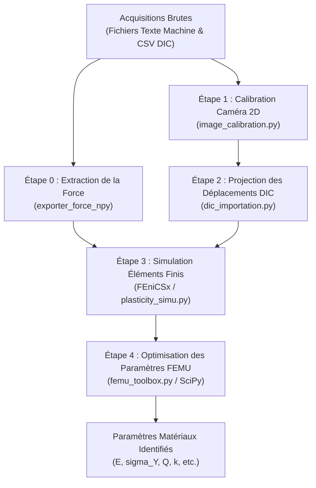


# Wiki & Documentation Technique du FEMU Toolbox

---

## 1. Présentation Générale et Objectif

Le FEMU Toolbox est un framework Python, indépendant du solveur, conçu pour identifier les paramètres de lois de comportement mécanique à partir de champs de déplacement issus de corrélation d'image VIC-2D obtenus lors d'essais mécaniques.

Le processus d'identification fonctionne en minimisant une fonction coût aux moindres carrés non linéaires, qui mesure l'écart entre les données cinématiques champ complet (les champs de déplacement superficiels expérimentaux mesurés par corrélation d'images numériques) et la réponse mécanique globale (les historiques de force de réaction mesurés par la machine de traction).

La totalité du framework stable se trouve dans le dossier "femu_toolbox". le dossier "OLD" contient tout les fichiers créés pendant le développement de femu_toolbox.

Le framework se découpe en 3 étapes principales : 
 - Calibration entre l'espace des images de DIC et l'espace du maillage/de la simulation élément finis.
 - L'importation des donnés de déplacement sur le maillage
 - La FEMU.

---

## 2. Flux de Travail et Architecture du Système

La chaîne de traitement se compose de cinq étapes principales, illustrées ci-dessous :

### Étape 1 : Calibration de la Caméra 2D

Module : /dic_projection/image_calibration.py.

Cette étape calcule la matrice de transformation homogène 4x4 T_cad_to_img, qui projette les coordonnées 3D CAO ou physiques (X, Y, Z) vers les coordonnées pixels 2D de la caméra (x_pixel, y_pixel). Elle se déroule en trois sous-étapes.

La rastérisation CAO (construct_reference_cad_image) centre et ajuste le maillage 3D CAO dans le canevas d'image pour générer une image binaire synthétique de la silhouette CAO, avec la matrice d'échelle préalable T_cad_ref.

Le recalage peut se faire en mode automatique (register_imgs), qui aligne l'image CAO synthétique avec l'image mouchetée DIC réelle via un recalage par similitude dans le domaine fréquentiel (imreg_dft), en appliquant un flou gaussien (sigma = 3.0) puis un seuillage Multi-Otsu pour segmenter la silhouette de l'éprouvette physique ; ou en mode manuel (register_imgs_manual), qui utilise une sélection interactive de points d'intérêt dans une fenêtre OpenCV côte à côte, puis estime une transformation affine robuste par RANSAC.

Enfin, la composition de matrice calcule T = T_ref_to_img @ T_cad_ref.

***TUTO***
Pour générer la matrice 4x4, il est conseillé d'utiliser le script 'test_calibration.py' ou fichier analogue
remplir les variables suivantes par les chemins des fichiers suivants :
MESH_MSH := le maillage .msh qui sera utilisé pour la simulation; maillage gmsh 3D, de préférence avec des éléments tétrahedres/hexaedres linéaires
REF_IMAGE := l'image de référence de l'éprouvette non déformée sur laquelle l'homographie sera calculée. (.tif,.png)
OUTPUT_NPY := l'endroit ou la matrice .npy sera exportée.

 L'option USE_MANUAL = True controle si oui ou non vous choisissez de faire un recalage manuel ou automatique. Il est recommandé de faire d'abord en automatique, puis si le recalage ne fonctionne pas, repasser en manuel.
Le mode manuel fonctionne par pointage. il faut pointer 4 points d’intérêts qui correspondent sur les deux images qui s'affichent, puis appuyer sur ENTER.

Quand la matrice 4x4 .npy est exportée, vous pouvez passer à la prochaine étape.

### Étape 2 : Projection des Champs Cinématiques sur le Maillage CAO

Module : dic_projection/dic_importation.py.

Cette étape projette la série temporelle de fichiers CSV de déplacement DIC 2D sur le maillage CAO volumique 3D (.msh / .vtu), en cinq sous-étapes.

Le maillage d'observation construit un maillage surfacique 2D triangulé à partir des coordonnées du premier CSV via une triangulation de Delaunay 2D filtrée par alpha-shape (create_reference_mesh_from_csv).

Le masquage de proximité utilise un KDTree 2D pour mesurer la distance entre les nœuds CAO et les points DIC, et assigne un masque binaire is_imported (0.1 pour les nœuds valides, 0.0 sinon).

L'interpolation spatiale projette les nœuds CAO dans l'espace image avec T_inv, puis interpole les vecteurs de déplacement par interpolation linéaire 2D (LinearNDInterpolator) à l'intérieur de l'enveloppe convexe, et par plus proche voisin (NearestNDInterpolator) à l'extérieur.

La transformation vectorielle reconvertit les vecteurs de déplacement dans le repère CAO en utilisant la matrice jacobienne inverse J_inv = inv(T[:3, :3]).

L'exportation sauvegarde chaque pas de temps au format VTU et génère le fichier wrapper manifest XML PVD (dic_series_projected.pvd) qui sera importé pour la FEMU. Ce fichier contient les donnés de déplacement 2D projetés sur le maillage.

***TUTO***
Il est conseillé de faire cette étape via le fichier "main_test.py" ou fichier analogue.
Premièrement, changez la variable project_csv = 0  en 1.
Importez dans la variable T la matrice générée dans l'étape précédente.
 T = np.load("calibration_matrix.npy")

La fonction "process_csv_series_to_cad_mesh" réalise la projection. 

Changez les options suivantes :

folder_path := le dossier où se trouvent les csv
file_prefix := le préfix des fichiers csv; attention si les fichiers s'appellent  file000001.csv","file000002.csv","file000003.csv", le préfix sera "file00".
mesh_cad_path:=le maillage .msh qui sera utilisé pour la simulation; maillage gmsh 3D, de préférence avec des éléments tétrahedres/hexaedres linéaires
output_pvd_path:= le chemin de l'export pvd-vtu

ech=108
start_idx=9
end_idx=5791
l'échantillonage fonctionne avec ces 3 variables. si vous ne voulez pas projeter tout les pas du csv, elles fonctionnent de sorte que pour ce set de valeurs, la premiere valeur viendra du fichier 9, 117, 225, 333, etc. le dernier fichier sera le 5733.

Cette fonction génère donc une suite de fichiers .vtu organisés par le wrapper en .pvd.

### Étape 4 : Boucle d'Optimisation des Paramètres FEMU

Module : femu_toolbox.py (fonction femu_res_toolbox).

Cette étape identifie les paramètres libres par moindres carrés non linéaires (scipy.optimize.least_squares), en six sous-étapes.

L'assemblage du vecteur résidu (compute_u_f_residuals_is_imported) concatène les erreurs de champ cinématique R_u = u_sim - u_ref, restreintes aux nœuds de surface Z égal à 0.0 et is_imported égal à 0.1, et les erreurs de force R_f = f_sim - f_ref.

La normalisation des résidus divise les résidus par leur écart-type empirique et un facteur d'échelle lié à la taille du vecteur, pondérés par les poids utilisateur weight_u et weight_f :

Res_u = (u_sim - u_ref) * weight_u / (std(Res_u) * sqrt(len(Res_u)))
Res_f = (f_sim - f_ref) * weight_f / (std(f_ref) * sqrt(len(Res_f)))

La normalisation des paramètres projette les paramètres libres bornés sur l'hypercube unité [0, 1], pour garantir une sensibilité homogène de l'optimiseur.

L'optimisation trust-region résout le problème de moindres carrés non linéaires avec l'algorithme Trust Region Reflective (trf).

La gestion des échecs applique une pénalité : en cas de divergence du solveur ou d'exception, un vecteur résidu de forte pénalité (1000.0) est renvoyé pour éloigner l'optimiseur des zones non convergentes.

Enfin, un affichage diagnostic en direct génère un tableau de bord graphique Matplotlib en temps réel, avec la norme des résidus, la courbe de force du recalage et de référence, et la trajectoire des paramètres d'optimisation en fonction du nombre d'itérations.

***TUTO***

Peut être lancé dans le fichier 'main_test.py'
PVD_file : str ou Path Chemin vers le fichier PVD référençant la série temporelle de fichiers de maillage VTU expérimentaux. FORCE_file : str ou Path Chemin vers le fichier `.npy` contenant les mesures expérimentales d'effort pour chaque pas de temps. 
Optim_params : dict Dictionnaire des valeurs initiales et des paramètres candidats `{nom_param: valeur}`. 
Bounds : dict ou None Dictionnaire associant les noms de paramètres à des n-uplets de bornes physiques `(min, max)`. Les paramètres présents dans `Bounds` sont traités comme des variables d'optimisation libres ; les paramètres omis restent fixes. solver : callable Fonction enveloppe (wrapper) du solveur de simulation exécutable acceptant des objets DOLFINx et des options d'exécution. config : dict, optionnel Dictionnaire de configuration de base permettant de surcharger les paramètres par défaut du solveur (`num_steps`, `T`, poids). 
ftol : float, défaut=1e-7 Tolérance d'arrêt basée sur la variation relative de la fonction coût dans `scipy.optimize.least_squares`. 
gtol : float, défaut=1e-8 Tolérance d'arrêt basée sur la norme du gradient dans `scipy.optimize.least_squares`. 
max_nfev : int, défaut=500 Nombre maximal d'évaluations de la fonction objectif. 
diff_step : float ou array-like, défaut=5e-3 Taille de pas relative pour l'approximation du Jacobien par différences finies. 
xtol : float ou None, défaut=None Tolérance d'arrêt basée sur la variation des variables indépendantes.

/!\ Solveur doit obligatoirement prendre en entrée UNIQUEMENT un dictionnaire avec toutes les infos dont il a besoin (valeurs des paramètres mécaniques, mais aussi des donnés de configuration, indifférents de l'optimisation) et doit ressortir un 2-uplet avec en premier une liste des valeurs de force à chaque pas de temps, et en 2eme un multiblock avec les valeurs des déplacements aux noeuds sur le maillage. Il doit correspondre au PVD créé dans les étapes précédentes. voici un solveur créé à partir d'un solveur fenicsx (infos dans l'annexe)

	PVD_FILE   = "MAINTEST/pyvista_exports/csv_projection/dic_series_projected_A305.pvd"
	FORCE_FILE = "MAINTEST/pyvista_exports/csv_projection/forces_sample_A305.npy"

    vtu_files = get_vtu_files_from_pvd(PVD_FILE)
    domain = load_domain_from_vtu(vtu_files[0])
    V, W, WT = build_function_spaces(domain)
    
    def my_solver(run_cfg):
        """
        Build a J2 isotropic-hardening model from the current parameter
        set in `run_cfg` and run the FE simulation.
 
        Must return (f_sim, sim_multiblock), exactly what
        `run_simulation_bc_vtu_fast` already returns.
        """
        model = J2IsotropicHardening(
            elastic=ElasticModel(run_cfg["E"], run_cfg["nu"], tdim=domain.topology.dim),
            sigma_Y=run_cfg["sigma_Y"],
            Q_var=run_cfg["Q_var"],
            k=run_cfg["k_hardening"],
        )
        f_sim, sim_multiblock = run_simulation_bc_vtu_fast(domain, V, W, WT, run_cfg, model=model)

        return 10*np.array(f_sim), sim_multiblock

    # Every parameter the model needs. Values are the initial guess for
    # parameters you want identified, or the fixed value otherwise.
    Optim_params = {
        "E": 210_000.0,          # will be identified (has bounds below)
        "nu": 0.30,               # fixed: no entry in Bounds
        "sigma_Y": 144.0,         # will be identified
        "Q_var": 50.0,            # fixed
        "k_hardening": 1500.0,   # fixed
    }
 
    # Only parameters listed here are optimized. Anything in Optim_params
    # that is NOT listed here is treated as fixed automatically.
    Bounds = {
        "Q_var": (50, 1000.0),
        "sigma_Y": (10.0, 1000.0),
        "k_hardening": (10.0, 1_500.0),
    }
 
    config = {
        "pvd_file_path" : PVD_FILE,
        "num_steps": 53, #len(vtu)-1
        "T": 3.0,
        "weight_u": 0.0,
        "weight_f": 5.0,
    }
 
    result = femu_res_toolbox(
        PVD_file=PVD_FILE,
        FORCE_file=FORCE_FILE,
        Optim_params=Optim_params,
        Bounds=Bounds,
        solver=my_solver,
        config=config,
    )

---

### Annexe : Simulation Éléments Finis Élastoplastique

Modules : simu_tools.py et plasticity_solver_import_bc/plasticity_simu.py.

Cette étape exécute la simulation mécanique non linéaire quasi-statique sous DOLFINx (FEniCSx), en cinq sous-étapes.

Les espaces de fonctions comprennent un espace vectoriel continu de Lagrange V (CG-1) pour le déplacement u, un espace scalaire discontinu W (DG-0) pour la déformation plastique cumulée p, et un espace tensoriel discontinu WT (DG-0) pour le tenseur de déformation plastique eps_p.

Les conditions aux limites peuvent être imposées de plusieurs façon différentes : soit (plasticity_solver_import_bc) directement importés de la DIC aux bords haut et bas (y+ et y-) et la face en Zmax ou min (la face différente de Z=0) est imposée Z=0. L'autre dossier (plasticity_solver_wholespecimen) applique des conditions homogenes sur les bords haut et bas comme dt*Vup en haut et dt*Vdown avec Vup et Vdown des vecteur qui sont pilotés par l'optimisation FEMU.

L'intégration du comportement traite les équations d'élastoplasticité par retour radial linéarisé en un pas.

Le solveur de Newton assemble la forme faible non linéaire F(u; v) = 0, avec calcul automatique de la matrice tangente exacte J = dF/du par différentiation symbolique UFL.

Le post-traitement intègre la force de réaction scalaire totale sur la surface supérieure ds(1), soit F_sim = int_{ds(1)} sigma_yy ds, et enregistre les champs de déplacement dans des structures PyVista MultiBlock sous l'étiquette "displacement".

## 3. Liste Complète des Hypothèses Formulées

Le fonctionnement de la chaîne repose sur l'ensemble des hypothèses physiques, géométriques, numériques et algorithmiques suivantes.

### 1. Hypothèses Géométriques et Cinématiques

La surface d'éprouvette est supposée plane et confondue avec le plan Z = 0 dans le repère CAO (plan XY). Les effets de gauchissement hors-plan ou de variation d'épaisseur dans la projection caméra sont négligés, la ligne et la colonne Z de la matrice de transformation 4x4 T étant fixées à l'identité.

Le masquage des nœuds observés en surface fait que les mesures DIC expérimentales ne sont prises en compte que pour les nœuds de surface vérifiant Z environ égal à 0.0 et is_imported environ égal à 0.1. la zone "is_imported" représente le domaine des valeurs de déplacement interpolé. en dehors de cette zone, les valeurs de déplacement sont extrapolées, notement pour pouvoir importer des conditions aux limites complètes sur les bords. Il est alors abérent de venir comparer les valeurs extrapolées aux valeurs de déplacement simulées. La différence entre les champ de déplacement ne se fait donc que sur le domaine "is_imported=0.1".

Pour la projection vectorielle de la cinématique, les vecteurs déplacement 2D de l'image sont transformés dans l'espace 3D CAO via le bloc jacobien inverse 3x3 en plan, u_cad = J_inv @ u_img avec J = T[:3, :3]. Le couplage de cisaillement hors-plan lors de la transformation est supposé nul.

Concernant l'interpolation spatiale et le filtrage des bords, le champ de déplacement à l'intérieur de l'enveloppe d'observation est supposé continu et interpolable linéairement (LinearNDInterpolator), tandis qu'à l'extérieur de l'enveloppe convexe il est supposé constant selon la direction du plus proche voisin (NearestNDInterpolator). Les contours des éprouvettes non convexes sont supposés fidèlement détourés par le filtrage Delaunay 2D par rayon alpha-shape.

### 2. Hypothèses de Calibration Caméra

Le modèle de projection caméra est affine ou en similitude : la projection caméra est modélisée par une transformation affine ou en similitude 2D dans le plan (translation, rotation 2D, échelle uniforme). Les distorsions optiques de la lentille, radiales ou tangentielles, sont supposées négligeables ou déjà corrigées.

La segmentation de la silhouette par binarisation suppose qu'un flou gaussien (sigma = 3.0) suivi d'un seuillage Multi-Otsu isole correctement l'éprouvette comme la zone la plus lumineuse.

En calibration manuelle, la coplanarité des repères est supposée : les points d'intérêt sélectionnés par l'utilisateur sont supposés coplanaires et appariés sans erreur entre la silhouette CAO et l'image réelle.

### 4. Hypothèses de Conditions aux Limites et Calcul de Force

Les conditions aux limites imposées par DIC supposent que les champs de déplacement DIC projetés sur les faces de bord représentent fidèlement les conditions réelles d'amarrage ou d'encastrement. Sur les faces latérales Y_min et Y_max, les composantes de déplacement dans le plan Ux et Uy sont directement imposées. Le mouvement de corps rigide hors-plan est éliminé en imposant Uz = 0 sur une seule face extérieure Z.

Pour le calcul de la force de réaction par intégration surfacique, la force de réaction simulée F_sim est égale à l'intégrale de la contrainte normale de Cauchy sigma_yy sur la surface supérieure ds(1) : F_sim = int_{ds(1)} sigma_yy ds. Les facteurs d'échelle constants, par exemple 10 * F_sim dans my_solver, représentent des facteurs de conversion géométrique ou d'épaisseur de l'éprouvette.

### 5. Hypothèses Numériques et d'Optimisation

Sur la discrétisation par éléments finis, le champ de déplacement u est discrétisé par des éléments de Lagrange continus d'ordre 1 (CG-1), tandis que les variables internes plastiques (p, eps_p) sont discrétisées par des éléments de Galerkin discontinus d'ordre 0 (DG-0) par cellule.

Pour la normalisation des paramètres, les paramètres libres sont projetés sur l'hypercube unité [0, 1] pendant l'optimisation, afin d'égaliser les sensibilités du gradient entre des paramètres d'ordres de grandeur très différents (par exemple E de l'ordre de 10^5 contre sigma_Y de l'ordre de 10^2).

Concernant la pondération et la normalisation des résidus, la fonction objectif combine l'erreur cinématique R_u et l'erreur de force R_f, normalisées par leurs écarts-types et la racine carrée de la dimension du vecteur. Les poids utilisateur weight_u et weight_f définissent l'arbitrage entre le recalage du champ de déplacement complet et le calage de la courbe de force globale.

Enfin, la stratégie de pénalité en cas d'échec fait que la non-convergence du solveur ou une proposition de paramètre non physique renvoie un vecteur résidu fixe de forte valeur (1000.0), en supposant que l'optimiseur par région de confiance s'éloignera des zones non convergentes.

---

## 4. Structure des Fichiers et Cartographie des Composants

| Fichier / Dossier | Rôle du Module | Principales Fonctions / Classes |
|---|---|---|
| main_test.py | Script d'exécution principal du pipeline complet | exporter_force_npy, my_solver, drapeaux d'exécution (force_export, project_csv, femu) |
| femu_toolbox.py | Moteur d'optimisation par moindres carrés non linéaires | femu_res_toolbox, compute_residuals_toolbox, compute_u_f_residuals_is_imported, normalize_params |
| simu_tools.py | Modèles de comportement et utilitaires FEniCSx | ElasticModel, J2IsotropicHardening, PlasticityModel, build_function_spaces, build_solver |
| test_calibration.py | Script autonome de calibration caméra | Calcul et exportation de la matrice de calibration vers .npy |
| dic_projection/dic_importation.py | Module de projection des séries CSV DIC | process_csv_series_to_cad_mesh, interpolate_displacement_obs_mesh_to_cad_mesh_2D_linear, create_reference_mesh_from_csv |
| dic_projection/image_calibration.py | Module de calcul de la matrice caméra | calibrate_2d, calibrate_2d_manual, construct_reference_cad_image, register_imgs |
| plasticity_solver_import_bc/plasticity_simu.py | Solveur EF avec conditions aux limites DIC | run_simulation_bc_vtu_fast, dirichlet_bcs_from_vtu |
| plasticity_solver_import_bc/hill48_model.py | Modèle de plasticité anisotrope de Hill48 | Hill48Model, Hill48state |
| plasticity_solver_wholespecimen/plasticity_simu.py | Solveur EF avec CL uniformes sur l'éprouvette | run_simulation_bc_vtu_fast, dirichlet_bcs |

